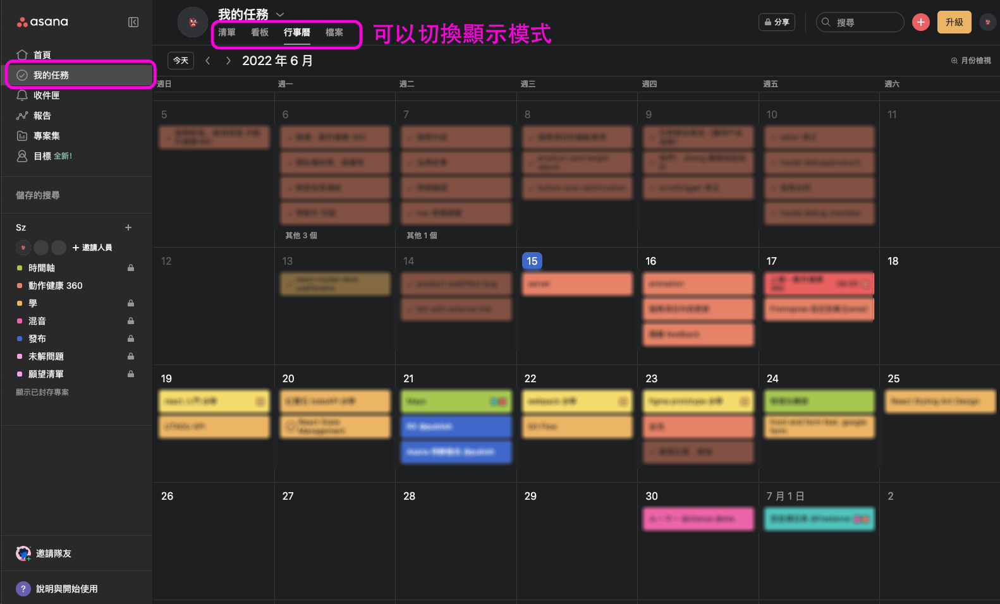

## 腦容量已經夠少別再記行程了，讓 Asana 條列化你的待辦事項！
我用過 Todoist, Google ToDo List，也有用過 Notion, Coda 那種可以寫待辦清單的軟體，想要找個適合的待辦清單軟體可以參考看看這篇，主要是針對主要使用電腦的用戶

> 筆記軟體的話我推薦：[Obsidian 幫你腦袋搬家（？）(index)](Obsidian%20幫你腦袋搬家（？）(index).md)

### 為什麼是 Asana
- 桌面版可以全域快捷鍵新增待辦
- 可以做很多事情，但又可以做得很快
- 可以連結其他行事曆，或是其他工具（例如：Google 行事曆）
- 也有手機 APP
- 最近開始有中文版了！

>團隊一起用的話還可以：
>
>- 可以指派任務，掌握彼此進度
>- 可以連結 Slack，讓溝通更順暢

#### 全域快捷鍵有多好用？
>推薦給常用電腦的人（如果大部分的事情都用手機的話，Google ToDo 真ㄉ很香）

用過 Google ToDo List 的話，應該會喜歡與 Google 產品（Gmail, 行事曆）的連結性吧？而且介面又很好上手很簡潔

但因為 Google 產品都是在網路上在網路上，使用時，需要一個「連到 Google 產品頁面」的動作……聽起來沒有任何問題？

但生活中的待辦事項每件都跟 Google 產品有關嗎？如果不是的話，這動作就有點麻煩了。

而全域快捷鍵就可以解決這個問題，==不管是跟朋友語音的時候，還是工作到一半，只要一講到需要等等完成的事情，直接使用全域快捷鍵叫出 Asana 加進去==，不需要「我等等開 Google 加」，結果等到有時間加的時候已經忘記是什麼事情了！

同樣，我也會因為這個原因不推薦把待辦寫在 Notion 類型的軟體，減少「進某個軟體找 XXX」的的步驟

### 怎麼用 Asana
Asana 比起其他待辦軟體，介面看起來可能比較複雜，簡單說明就是：
待辦清單**最主要**用「專案」作分類，再用「優先度」、「標籤」等等功能作更複雜的歸納

> 建議整理得好專案分類後，再來考慮用優先度、標籤等功能！

### 介面介紹
#### 首頁
首頁可以自訂，不多講，主要就是可以綜觀所有的待辦內容

#### 我的任務
可以用不同顯示方法看到待辦任務，我自己最常用行事曆、清單兩種，其他還有像 Trello 的介面，或是一些付費的介面，可以研究

#### 專案分類
除了綜觀之外也可以點進不同專案分類看，介面跟「我的任務」是幾乎一樣的

#### 新增待辦
在桌面版中，進到設定開啟全域快捷鍵吧！

這樣不管你是在寫筆記、查 email、跟朋友聊天的時候，只要想到什麼事情沒作，就可以直接快捷鍵加到待辦裡面囉！

這塊可以用 `tab` 建快速切換，快速填入專案分類

### 想要開始習慣化記待辦了嗎？
用 Asana 的專案細分開不同類型的任務，越具體越好。不要使用「工作」、「休閒」這種太模糊的分類，==盡量使用「有明確終點」的分類==。像是：
- 聖誕節準備
- OO 工作坊籌劃
- XX 旅遊規劃
- 期中考準備

讓你可以更清楚的知道說，除了綜觀有什麼事情需要完成之外，還可清楚掌握是哪一件事還沒有完成，完成後就可以封存該專案，維持畫面簡潔

其他無法被明確分類的待辦事項，再用模糊的專案命名來分類。

> 分類模糊會導致，用久會發現有些待辦會很難被分類，導致新增待辦時，反而花很多時間在分類，最後就不想分了（跟整理房間道理一樣）

### 好像該有個結尾
只要可以成功養成習慣的軟體就是好軟體！